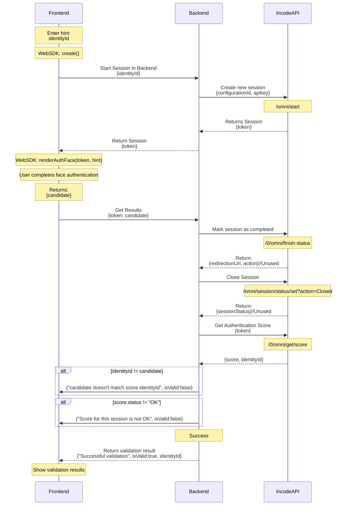

# Face Authentication Validation Example

This project demonstrates a secure face authentication flow using Incode's WebSDK with proper validation and session management. The application implements:

- **User hint input** for authentication (identityId)
- **Face authentication** using Incode's renderAuthFace SDK
- **Backend validation** to verify authentication integrity by:
  - Matching candidate from the SDK with identityId from the score API
  - Validating overall status to be OK
  - Closing sessions to prevent modification

This example showcases best practices for implementing face authentication in a web application with proper security measures.

## Authentication Flow



# Requirements

Vite 8 requires **Node.js ^20.19.0 || >=22.12.0**. Run `node -v` to verify before installing.

# Install

Run `npm install`

# Config

Copy `.env.example` to `.env.local` and add your local values

```
VITE_API_URL=https://demo-api.incodesmile.com/0
VITE_SDK_URL=https://sdk.incode.com/sdk/onBoarding-1.80.1.js

# HERE ONLY FOR DEMO PURPOSES, THE APIKEY AND THE FLOW_ID SHOULD NEVER BE IN THE FRONTEND.
VITE_FAKE_BACKEND_APIURL=https://demo-api.incodesmile.com
VITE_FAKE_BACKEND_APIKEY=
VITE_FAKE_BACKEND_FLOW_ID=
```

Remember the Flow holds the backend counter part of the process, some configurations there might affect the behavior of the WebSDK here.

# Example Backend

Starting and finishing the session must be done in the backend. To simplify development, this
sample includes an `example_backend.js` file that handles backend operations in the frontend.

**Important:** Replace this with a proper backend for production. The API key should NEVER be exposed in the frontend.

## Key Backend Functions

- `start(identityId)` - Calls Incode's `/0/omni/start` API to create a new session and returns the session `token`
- `getResults(token, candidate)` - Verifies the authentication by:
  - Finishing the session via `/0/omni/finish-status` to trigger score calculation
  - Closing the session via `/0/omni/session/status/set?action=Closed` to freeze the score
  - Retrieving the score via `/0/omni/get/score`
  - Comparing `candidate` (from the WebSDK) with `identityId` from the score to prevent tampering
  - Checking that the overall score status is "OK"

# Run

Vite is configured to serve the project using https and and expose him self, so you can easily test with your mobile phone on the local network.

run `npm run dev`

A new server will be exposed, the data will be in the terminal

# Build

run `npm run build`

A new build will be created in `/dist` you can serve that build everywhere just remember to serve with https.

# Testing especific versions of the webSDK locally

You can save the specific version needed under `/public` and change the `VITE_SDK_URL` variable on `.env.local` to something like:

```
VITE_SDK_URL=/name-of-the-js-file.js
```
